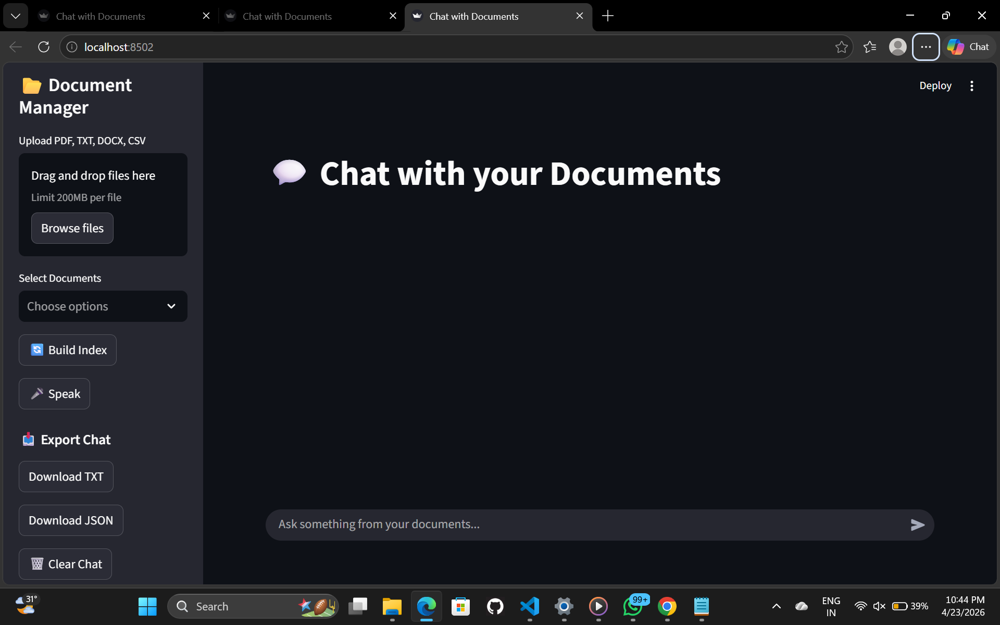
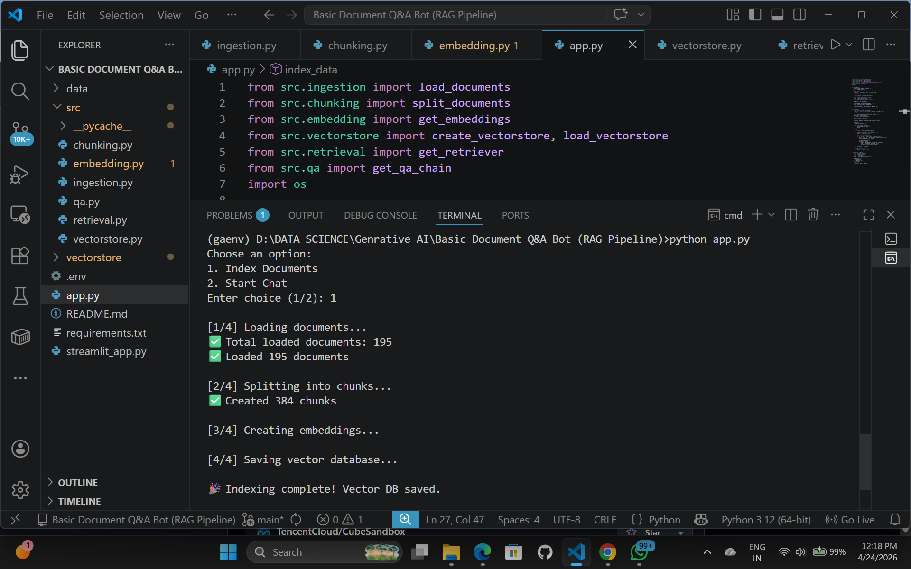
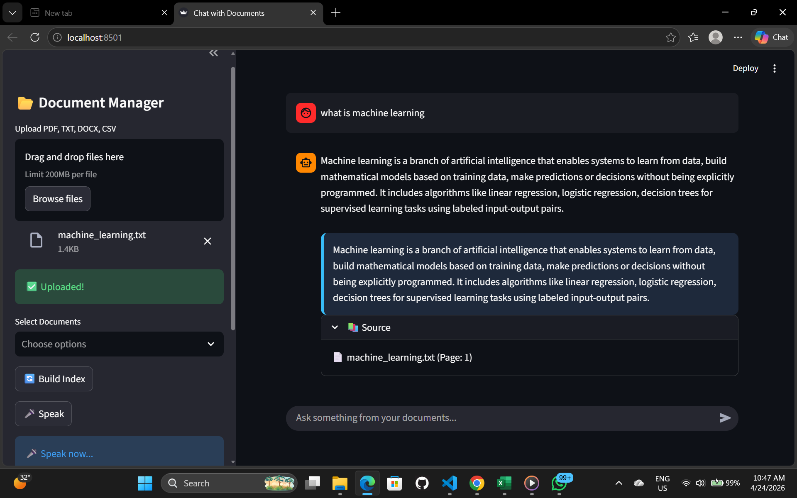
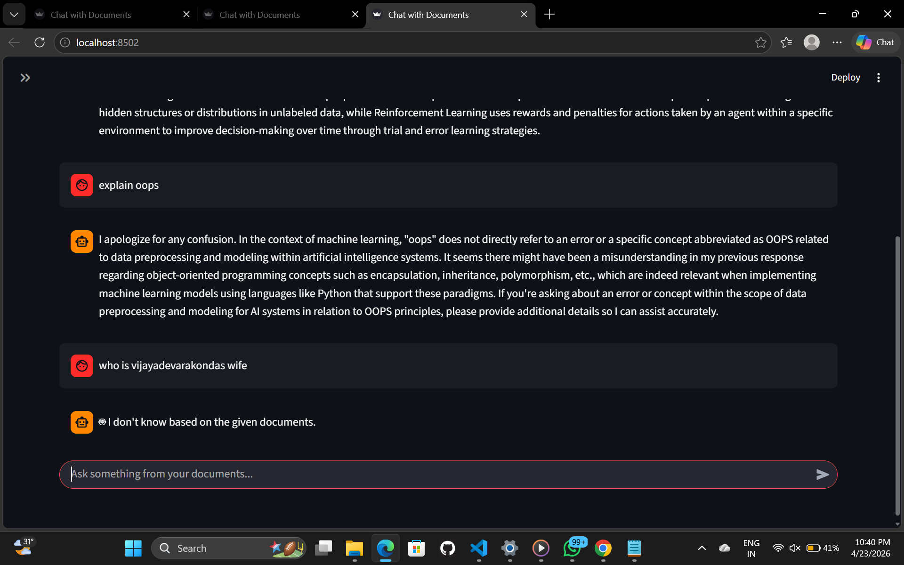

# 📄 Document Q&A Bot (RAG Pipeline)

## 🚀 Overview

This project is a **Document Question & Answer Bot** built using a **Retrieval-Augmented Generation (RAG)** pipeline.
It allows users to upload documents and ask questions, and the system generates answers **strictly based on the document content**.

The system avoids hallucinations by retrieving relevant context from documents before generating answers.

---

## 🎯 Features

* 📂 Upload documents (PDF, TXT, DOCX, CSV)
* 🔍 Semantic search using vector embeddings
* 💬 Chat-based interface (like ChatGPT)
* 🧠 Context-aware responses with memory
* 📚 Source citation (filename + page number)
* 🎤 Voice input support
* 📥 Export chat (TXT / JSON)
* 🎨 Beautiful Streamlit UI
* 🚫 “I don’t know” fallback for missing answers

---

## 🧠 Architecture (RAG Pipeline)
### ⚙️ Design Decisions

---

### 🔹 Chunking Strategy
We used **fixed-size chunking with overlap**.

- Chunk size: ~500 characters
- Overlap: ~50–100 characters

✅ Reason:
- Prevents losing context between chunks
- Improves retrieval accuracy
- Works well for PDFs and mixed document formats

---

### 🔹 Embedding Model
We used **HuggingFace Embeddings (sentence-transformers)**.

✅ Reason:
- Free and open-source (no API cost)
- Good semantic understanding
- Works well with FAISS

---

### 🔹 Vector Database
We used **FAISS (Facebook AI Similarity Search)**.

✅ Reason:
- Fast similarity search
- Lightweight and runs locally
- No need for external server/database
- Supports persistence (saved to disk)

---

### 🔹 LLM Choice
We used **Ollama with Phi3 model**.

✅ Reason:
- Fully open-source and runs locally
- No API key required
- Suitable for offline and low-cost environments

---

### 🔹 Retrieval Strategy
- Top-K similarity search (k=5)
- Returns most relevant chunks based on query

✅ Reason:
- Balances accuracy and performance
- Ensures relevant context is passed to LLM

---

### 🔹 Hallucination Control
- Strict prompt: "Use only context"
- If no relevant chunks → returns:
  "I don't know based on the given documents."

✅ Reason:
- Prevents incorrect answers
- Ensures grounded responses

---


## 📁 Project Structure

```
document-qa-bot/
│
├── data/                  # Input documents
├── vectorstore/           # FAISS database
│
├── src/
│   ├── ingestion.py       # Load documents
│   ├── chunking.py        # Split text
│   ├── embedding.py       # Create embeddings
│   ├── vectorstore.py     # Save/load FAISS
│   ├── retrieval.py       # Retrieve chunks
│   └── qa.py              # LLM + QA chain
│
├── app.py                 # CLI application
├── streamlit_app.py       # Streamlit UI
├── requirements.txt
└── README.md
```

---

## 🖼️ UI Screenshots

### 📌 UI Interface


---
### 📌  Indexing

---

### 💬 Chat Interface 1


---

### 💬 Chat Interface 2


---

---

## ⚙️ Installation

### 1️⃣ Clone Repository

```bash
git clone https://github.com/your-username/document-qa-bot.git
cd document-qa-bot
```

### 2️⃣ Create Virtual Environment

```bash
python -m venv venv
venv\Scripts\activate   # Windows
```

### 3️⃣ Install Dependencies

```bash
pip install -r requirements.txt
```

---

## 🤖 Setup LLM (Ollama)

Install Ollama and pull model:

```bash
ollama pull phi3
```

Run Ollama:

```bash
ollama run phi3
```

---

## ▶️ Run the Project

### CLI Version

```bash
python app.py
```

### Streamlit UI

```bash
streamlit run streamlit_app.py
```

---

## 📌 How to Use

1. Upload documents in the UI
2. Click **Build Index**
3. Ask questions in chat
4. View answers with sources

---

## 🧪 Example Queries

* What is machine learning?
* Explain SQL joins
* What is Day 1 activity?
* Summarize the document

---

## 🛡️ Hallucination Control

The system ensures:

* Answers are generated **only from retrieved context**
* If answer is not found:

  ```
  "I don't know based on the given documents."
  ```

---

## 📊 Technologies Used

* Python
* LangChain
* FAISS (Vector DB)
* HuggingFace Embeddings
* Ollama (Phi3 LLM)
* Streamlit (UI)

---

## 🚀 Future Improvements

* 🌐 Deploy on cloud (AWS / Streamlit Cloud)
* 🔎 Hybrid search (BM25 + Vector)
* 📌 Highlight exact answer in PDF
* ⚡ Faster retrieval with caching
* 🧾 Multi-user support

---


## 👩‍💻 Author

**Seelam Divya Kumari**
Python Developer | Machine Learning | GenAI Enthusiast

---

## ⭐ If you like this project

Give it a ⭐ on GitHub!

